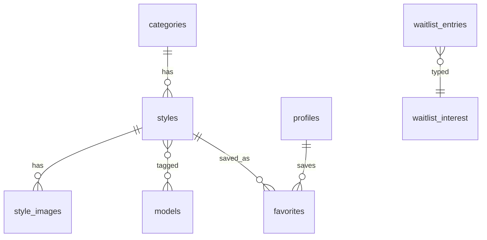

# Content Model & Taxonomy — AIPromptGrid v1

**Status:** Draft for approval (Phase 0)  
**Product:** AIPromptGrid  
**Last updated:** 2026-09-12  
**Related:** [prd-v1.md](./prd-v1.md) · [ia-sitemap.md](./ia-sitemap.md) · [brand-positioning.md](./brand-positioning.md)

---

## 1. Purpose

Define the data shape for styles, categories, images, users, favorites, and waitlists — plus the **taxonomy** used for Explore by style/concept and model filters. This drives Supabase schema, admin forms, and public filters.

---

## 2. Entity overview

| Entity | Public? | Notes |
| --- | --- | --- |
| `categories` | Yes (published styles only implied) | Style / concept buckets |
| `styles` | Published only | Core product unit |
| `style_images` | Via published style | Before/after proof |
| `models` | Yes (as tags/filters) | Can be enum/table; see §5 |
| `profiles` | No | Extends auth user; role |
| `favorites` | Owner only | user ↔ style |
| `waitlist_entries` | Admin only | Email + interest |

---

## 3. `categories` (style / concept)

Browse labels in the spirit of competitor/reference [proxima.art](https://proxima.art/) “Explore AI Prompts by Style / Concept” — **shorter curated set** for v1 (we do not replicate their megacloud of 100+ concepts at launch). See [competitor-proxima.md](./competitor-proxima.md).

| Field | Type | Required | Notes |
| --- | --- | --- | --- |
| `id` | uuid | yes | PK |
| `name` | text | yes | Display name |
| `slug` | text | yes | Unique; URL `/categories/[slug]` |
| `description` | text | no | Short intro on category page |
| `sort_order` | int | yes | Default 0; lower first |
| `created_at` | timestamptz | yes | |
| `updated_at` | timestamptz | yes | |

**v1 launch taxonomy (seed):**

| Name | Slug | Role |
| --- | --- | --- |
| Vintage Film | `vintage-film` | Analog, grain, faded tones |
| Cinematic | `cinematic` | Movie lighting / composition |
| Portrait | `portrait` | Face / identity-forward looks |
| Fashion | `fashion` | Wardrobe / editorial looks |
| Street & Documentary | `street-documentary` | Candid, city, reportage feel |
| Selfie Transformation | `selfie-transformation` | Upload-photo viral looks |
| Retro & Nostalgia | `retro-nostalgia` | Decades / eras (generic naming) |
| Fantasy & Surreal | `fantasy-surreal` | Non-photo-real creative looks (small share) |
| Product & Commercial | `product-commercial` | Optional; keep thin at launch |

Admins may add categories later; launch catalog should map every style to **exactly one** primary category in v1 (keeps filters simple).

**Rule:** Category names stay universal. Place or culture specifics belong in the **style title/prompt**, not in taxonomy labels.

---

## 4. `styles`

| Field | Type | Required | Notes |
| --- | --- | --- | --- |
| `id` | uuid | yes | PK |
| `title` | text | yes | Public name |
| `slug` | text | yes | Unique; `/styles/[slug]` |
| `short_description` | text | no | ~1 sentence for cards / SEO |
| `prompt` | text | yes | Full copyable prompt |
| `how_to_use` | text | no | Optional short steps |
| `category_id` | uuid | yes | FK → categories |
| `status` | enum | yes | `draft` \| `published` |
| `is_featured` | bool | yes | Default false; home Featured |
| `model_slugs` | text[] | yes | At least one; see §5 |
| `seo_title` | text | no | Fallback: title |
| `seo_description` | text | no | Fallback: short_description |
| `copy_count` | int | yes | Default 0; increment on copy |
| `published_at` | timestamptz | no | Set when first published |
| `created_at` | timestamptz | yes | |
| `updated_at` | timestamptz | yes | |
| `created_by` | uuid | no | FK → profiles (optional) |

### Publish validation

A style may move to `published` only if:

1. `title`, `slug`, `prompt`, `category_id` set  
2. At least one `model_slug`  
3. At least one image with role `before` **and** one with role `after`  
4. Slug unique  

Drafts may omit images.

### Future (do not build UI in v1)

| Field | Purpose |
| --- | --- |
| `is_premium` | Unused; schema stub optional |
| `credit_cost` | Unused |

---

## 5. Models (taxonomy for filters)

Stored as controlled slugs on `styles.model_slugs` (text array) in v1 — no separate admin CRUD required. Optional `models` lookup table later.

| Slug | Display label |
| --- | --- |
| `gemini` | Gemini |
| `chatgpt` | ChatGPT |
| `midjourney` | Midjourney |
| `flux` | Flux |
| `stable-diffusion` | Stable Diffusion |
| `other` | Other |

**Rules:**

- Only list models the prompt was **actually tested** on.  
- Multiple allowed.  
- Public UI never claims “works everywhere.”

---

## 6. `style_images`

| Field | Type | Required | Notes |
| --- | --- | --- | --- |
| `id` | uuid | yes | PK |
| `style_id` | uuid | yes | FK → styles |
| `storage_path` | text | yes | Supabase Storage path |
| `public_url` | text | yes | Or derived from path |
| `role` | enum | yes | `before` \| `after` \| `gallery` |
| `alt_text` | text | yes | Accessibility / SEO |
| `sort_order` | int | yes | Order within role |
| `created_at` | timestamptz | yes | |

**v1 expectation:** One primary `before` + one primary `after`. Extra `gallery` optional.

**Legal:** Prefer synthetic or owned likenesses; no unpaid real-person faces as proof (see legal notes doc).

---

## 7. `profiles`

Extends Supabase `auth.users`.

| Field | Type | Required | Notes |
| --- | --- | --- | --- |
| `id` | uuid | yes | = auth.users.id |
| `display_name` | text | no | Optional |
| `role` | enum | yes | `user` \| `admin` (default `user`) |
| `created_at` | timestamptz | yes | |
| `updated_at` | timestamptz | yes | |

Bootstrap: set first admin manually in DB / SQL.

---

## 8. `favorites`

| Field | Type | Required | Notes |
| --- | --- | --- | --- |
| `user_id` | uuid | yes | FK → profiles |
| `style_id` | uuid | yes | FK → styles |
| `created_at` | timestamptz | yes | |
| PK | (`user_id`, `style_id`) | | Unique pair |

Only published styles should appear in the account UI (hide or cascade if style unpublished).

---

## 9. `waitlist_entries`

| Field | Type | Required | Notes |
| --- | --- | --- | --- |
| `id` | uuid | yes | PK |
| `email` | text | yes | Normalized lowercase |
| `interest` | enum | yes | `video` \| `generator` |
| `created_at` | timestamptz | yes | |
| Unique | (`email`, `interest`) | | Dedupe per list |

---

## 10. Search & filter fields (derived)

| Filter | Source |
| --- | --- |
| Category | `styles.category_id` / category slug |
| Model | `styles.model_slugs` contains |
| Search `q` | `title`, `short_description` (optional: prompt excluded from public search to reduce scrape noise — **v1: search title + short_description only**) |
| Featured | `is_featured = true` AND `status = published` |

---

## 11. RLS summary (intent)

| Table | Anonymous | Authenticated user | Admin |
| --- | --- | --- | --- |
| categories | read all | read | write |
| styles | read `published` | read `published` | full |
| style_images | read if style published | same | full |
| favorites | none | own rows | own + optional read all |
| waitlist_entries | insert (controlled) | insert | read/delete |
| profiles | none | read/update own (not role) | manage roles via SQL/service |

Exact policies in Phase 2 migrations.

---

## 12. Content writing rules (prompt field)

For every published style:

1. **Identity lock** when the use case is photo transformation (keep face/identity recognizable unless the style is full character invent).  
2. **Style instructions** clear: era, lighting, wardrobe, setting, film/camera cues as needed.  
3. **Realism guards** where relevant (hands, proportions, expression).  
4. **No brand-hero specificity** — prompts may mention places/eras; site marketing copy stays global.  
5. **Model honesty** — only tag tested models; note quirks in `how_to_use` if needed.

Full launch title list → catalog brief (next doc).

---

## 13. Approval checklist

- [ ] Entities and required fields agreed  
- [ ] Launch category list OK (edit names if needed)  
- [ ] Model slug list OK  
- [ ] Publish rules (before + after required) OK  
- [ ] Proceed to catalog brief + design + tech docs  

Once approved, next: launch catalog brief, legal notes, design direction, tech checklist.
