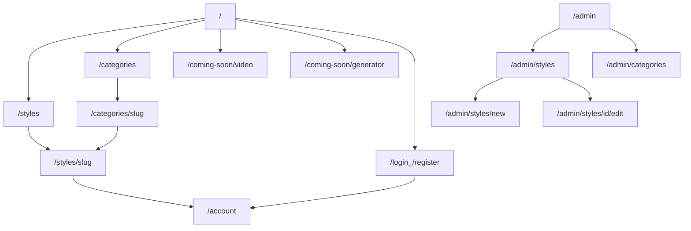
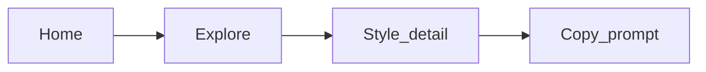
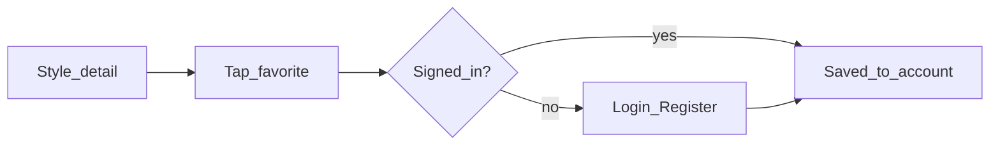
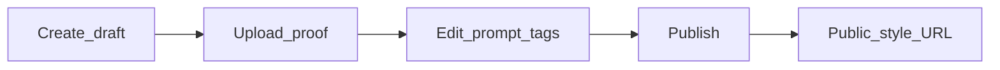

# IA & Sitemap — AIPromptGrid v1

**Status:** Draft for approval (Phase 0)  
**Product:** AIPromptGrid  
**Last updated:** 2026-09-12  
**Related:** [brand-positioning.md](./brand-positioning.md) · [prd-v1.md](./prd-v1.md) · [competitor-proxima.md](./competitor-proxima.md)  
**Competitor + UX reference:** [proxima.art](https://proxima.art/) — follow Create/Explore, Featured, style/concept browse; do not clone generator-first product or visuals ([details](./competitor-proxima.md))

---

## 1. Information architecture goals

1. **Discover → decide → copy** in as few steps as possible.  
2. Mirror a clear **Explore** mental model (styles + concepts), with **Create** deferred to waitlists.  
3. Never gate browse or copy behind auth.  
4. Keep admin separate from the public product surface.  
5. Brand-first home; one job per section.

---

## 2. Site map (routes)

### 2.1 Public

| Route | Page | Purpose |
| --- | --- | --- |
| `/` | Home | Brand, primary CTA, Featured styles, Explore by style/concept teaser, soft CTAs to waitlists |
| `/styles` | Explore — all styles | Full grid; search + filters (category, model) |
| `/styles/[slug]` | Style detail | Before/after, prompt, copy, models, favorite, related |
| `/categories` | Categories index | List all style/concept categories |
| `/categories/[slug]` | Category detail | Styles in one concept; same filter affordances as needed |
| `/coming-soon/video` | Video prompts waitlist | Honest coming soon + email capture |
| `/coming-soon/generator` | In-app generator waitlist | Honest coming soon + email capture |
| `/login` | Sign in | Magic link + Google |
| `/register` | Register | Same auth providers; link to sign in |
| `/account` | Account / favorites | Favorites list; sign out |
| `/privacy` | Privacy Policy | Legal |
| `/terms` | Terms of Service | Legal |

### 2.2 Admin (protected)

| Route | Page | Purpose |
| --- | --- | --- |
| `/admin` | Admin home | Counts + quick links (styles, categories) |
| `/admin/styles` | Styles list | All statuses; filter draft/published; edit links |
| `/admin/styles/new` | Create style | Draft form + image upload |
| `/admin/styles/[id]/edit` | Edit style | Update fields, images, publish/unpublish, feature |
| `/admin/categories` | Categories CRUD | Create/edit list used by styles |

Non-admins hitting `/admin/*` → redirect to `/` or `/login`.

### 2.3 System / SEO (not nav)

| Route / asset | Purpose |
| --- | --- |
| `/sitemap.xml` | Search indexing |
| `/robots.txt` | Crawler rules |
| `/auth/callback` | Supabase OAuth / magic-link callback (implementation detail) |

---

## 3. Hierarchy diagram

---

## 4. Primary navigation

Aligned with competitor [proxima.art](https://proxima.art/) **Create / Explore** split ([competitor-proxima.md](./competitor-proxima.md)), adapted for v1 (library-first):

### Header (public)

| Label | Target | Notes |
| --- | --- | --- |
| **AIPromptGrid** (logo/wordmark) | `/` | Brand-first |
| Explore | `/styles` | Primary product path |
| Categories | `/categories` | Style / concept browse |
| Create ▾ | Dropdown | **Not** a live generator |
| → Video prompts | `/coming-soon/video` | Waitlist |
| → Image generator | `/coming-soon/generator` | Waitlist |
| Sign in | `/login` | When logged out |
| Account | `/account` | When logged in |

Mobile: same links in a compact menu; Create items listed flat under Explore or a single “Coming soon” group.

### Footer

| Group | Links |
| --- | --- |
| Product | Explore, Categories, Video waitlist, Generator waitlist |
| Account | Sign in / Account |
| Legal | Privacy, Terms |
| Optional | Contact email (later) |

---

## 5. Page IA (sections per page)

### `/` Home — one composition first viewport

**First viewport only:** brand (AIPromptGrid) + one headline + one short supporting line + one CTA group (Explore styles) + one dominant visual.

**Below fold (one job each):**

1. **Featured styles** — grid strip → “Explore all styles”  
2. **Explore by style / concept** — category chips or tiles → category or filtered explore  
3. **Coming soon** — two honest links (video + generator), no fake UI  
4. Footer  

### `/styles` Explore

- Page title + short line  
- Controls: search, category filter, model filter, reset  
- Style grid (thumbnail, title, model tags)  
- Empty state if no matches  

### `/styles/[slug]` Style detail

- Title + category + model tags  
- Before / after proof  
- Prompt block + **Copy**  
- Favorite (auth gate for action only)  
- Related styles  
- Optional short “How to use” (paste into tagged model)  

### `/categories` & `/categories/[slug]`

- Index: list/grid of concepts with style counts  
- Detail: category intro + styles grid (same card pattern as Explore)  

### Waitlist pages

- Headline + one sentence honesty  
- Email field + submit  
- Success state  
- Link back to Explore  

### `/account`

- Favorites grid  
- Empty state → CTA to Explore  
- Sign out  

### Admin

- List-heavy, utilitarian; no marketing chrome  
- Styles: table/list with status, featured, edit  
- Form: fields matching content model (separate doc)  

---

## 6. User flows (happy paths)

### Browse → copy (no account)

### Favorite

### Admin publish

---

## 7. URL & naming rules

| Rule | Example |
| --- | --- |
| Style slugs | kebab-case, unique: `/styles/vintage-film-portrait` |
| Category slugs | kebab-case: `/categories/vintage-film` |
| No query required for core pages | Filters may use `?category=&model=&q=` on `/styles` |
| Stable public URLs | Changing title should not break slug without redirect plan |
| Admin uses ids | `/admin/styles/[id]/edit` (not public slugs) |

---

## 8. What’s not in the sitemap (v1)

- `/pricing`, checkout, premium unlock pages  
- Live `/create` or `/generate` studios  
- `/videos` library  
- Community / upload / profile public pages  
- Blog / news (optional later; omit for launch)  
- Blurred fake catalog routes  

---

## 9. Approval checklist

- [ ] Public routes cover home, explore, detail, categories, waitlists, auth, account, legal  
- [ ] Admin routes separated and protected  
- [ ] Nav matches Explore-first + Create-as-waitlist  
- [ ] Home first-viewport rules match brand doc  
- [ ] Proceed to content model & taxonomy  

Content model: [content-model.md](./content-model.md).
